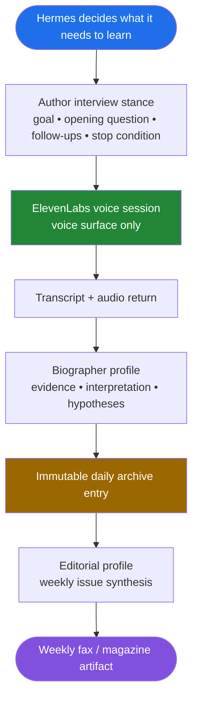
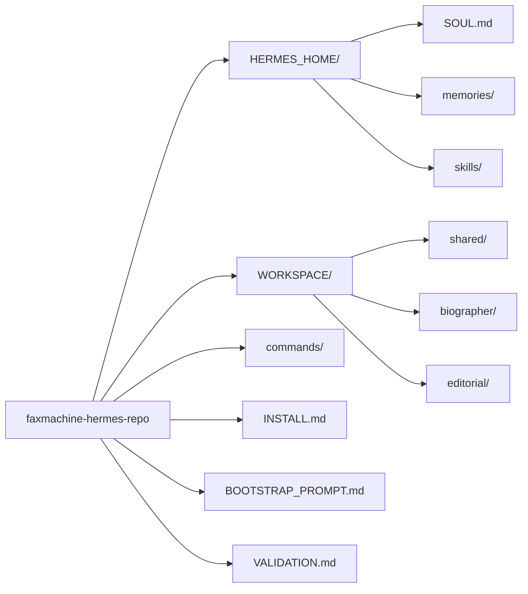

# FaxMachine

The personal chronofile that interviews you, archives you, and publishes you back to yourself.

> Built as a Hermes-native system for the Hermes Agent Creative Hackathon.

Most personal AI systems either chat with you or track you. FaxMachine does something else: it treats your life as documentary material. Hermes decides what it needs to learn, conducts or shapes a daily voice interview, turns the result into an immutable archive entry, and then builds a weekly editorial artifact from the week of evidence.

## What It Does

You speak. Hermes listens with a purpose.

Over time it starts building:

- a daily record of what actually happened
- an evolving identity image grounded in evidence
- a weekly artifact that surfaces patterns, tensions, and what is worth preserving

The point is not to produce motivational summaries. The point is to build a durable record that becomes more useful over time.

## Architecture



## Hermes Features Used

| Feature | How It Is Used |
|---|---|
| Profiles | Separate `biographer` and `editorial` roles |
| Role Workspaces | Keeps biographer and editorial working state separate while sharing the archive layer |
| SOUL | Defines the baseline stance of the archival intelligence |
| Memory | Holds stable operating rules and bounded user preferences |
| Bootstrap Skill | Initializes the workspace and verifies canonical files |
| Skills | Defines how Hermes authors one interview session |
| Workspace Context | Keeps shared archive truth separate from role-specific work |
| Tools / Providers | Lets Hermes use voice, calendar, and Discord without those providers owning the behavior |

## Core Loop

1. Hermes decides what it wants to learn today.
2. Hermes creates the interview stance.
3. ElevenLabs delivers the session as the voice surface.
4. Hermes turns the result into one immutable daily archive entry.
5. Hermes uses the week of archive entries to create one editorial artifact.

## Workspace Shape

This repo is a Hermes bootstrap package, not a traditional app scaffold.

```txt
HERMES_HOME/
  SOUL.md
  memories/
  skills/

WORKSPACE/
  AGENTS.md
  shared/
  biographer/
  editorial/
```

## Canonical Files

- `WORKSPACE/shared/archive/daily_entries.md`
- `WORKSPACE/shared/archive/weekly_issues.md`
- `WORKSPACE/shared/sources/source_index.md`
- `WORKSPACE/shared/sources/unresolved_claims.md`
- `WORKSPACE/shared/sources/conflicting_records.md`
- `WORKSPACE/shared/timelines/master_timeline.md`
- `WORKSPACE/shared/timelines/project_timeline.md`
- `WORKSPACE/biographer/living_biography.md`
- `WORKSPACE/biographer/private_self_model.md`
- `WORKSPACE/biographer/interview_logs.md`
- `WORKSPACE/biographer/questions_for_user.md`
- `WORKSPACE/biographer/weekly_self_model_update.md`
- `WORKSPACE/editorial/public_bio.md`
- `WORKSPACE/editorial/public_safe_claims.md`
- `WORKSPACE/editorial/issue_workbench.md`

## Quick Start

```bash
bash commands/install_faxmachine.sh
faxmachine chat
```

Then use the prompt in [BOOTSTRAP_PROMPT.md](./BOOTSTRAP_PROMPT.md).

The bootstrap flow uses a real Hermes skill:

- `HERMES_HOME/skills/faxmachine-bootstrap/SKILL.md`

## What Hermes Owns

Hermes owns:

- what the interview is trying to learn
- how the interviewer behaves
- what counts as enough evidence
- how archive material is interpreted
- how the weekly issue is framed

Providers do not own that behavior.

## Role Workspace Model

FaxMachine uses:

- a shared archive layer for durable truth
- a `biographer` workspace for private synthesis and interview work
- an `editorial` workspace for public drafting and issue assembly

This keeps the real work between the two roles while letting both operate over the same archive substrate.

## Providers

- ElevenLabs: voice surface
- Google Calendar: timing input
- Discord: sparse clarification line

## Project Structure



## Why This Is Different

FaxMachine is not trying to be:

- a personal OS
- a wellness tracker
- a life coach
- a productivity assistant

It is trying to be:

- a biographer
- an archive
- an editorial system

The weekly artifact matters more than the interface.

## Install

See [INSTALL.md](./INSTALL.md).

## Validation

See [VALIDATION.md](./VALIDATION.md).
